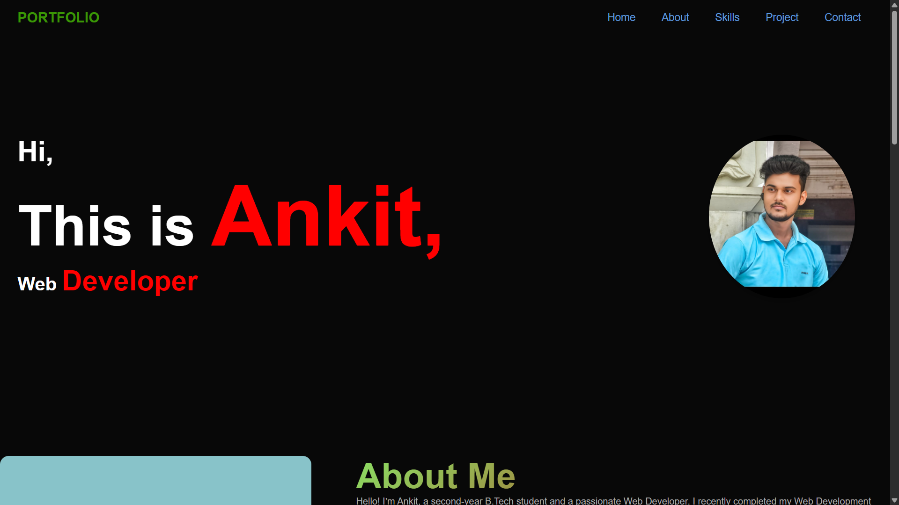

# 💼 Ankit's Developer Portfolio

A fully responsive, modern personal portfolio website built using **HTML, CSS, and JavaScript** as part of **Task 1** of the **CodSoft Web Development Internship (Level 1)**.

> 👨‍💻 Name: Ankit Kumar  
> 🧑‍🎓 B.Tech – 2nd Year Student (2024–2028)  
> 💼 Internship: CodSoft Web Development  
> 📅 Task: 1 – Portfolio Website  
> 📌 Technologies: HTML, CSS, JavaScript

---

## 🌟 Features

- 🎨 Clean, elegant, and responsive design
- 📱 Mobile-friendly layout with flexible sections
- 👋 Hero section with name, role, and photo
- 📜 About Me with skills, experience, and education tabs
- 🛠️ Projects section with descriptions and live/demo links
- 📄 Resume download button
- 📬 Contact section with form and social links
- 🧩 Smooth transitions and tab-switching interactivity

---

## 📁 Folder Structure

    Task-1_Portfolio/
    ├── index.html
    ├── style.css
    ├── photo.jpg
    ├── resume.pdf
    └── (script included inline in HTML)

---

## 📸 Sections Overview

| Section       | Description                                      |
|---------------|--------------------------------------------------|
| **Home**      | Welcome hero with intro and role title           |
| **About**     | Introduction, goals, hobbies                     |
| **Skills**    | Tech stack, tools, and current learning          |
| **Experience**| CodSoft internship and project work              |
| **Education** | B.Tech timeline and learning journey             |
| **Projects**  | Portfolio, Landing Page, Calculator with links   |
| **Resume**    | Downloadable resume (PDF)                        |
| **Contact**   | Email, LinkedIn, GitHub + message form           |
| **Footer**    | Copyright info and quick links                   |

---

## 🔗 Live Preview

> 

---

## 🧑‍💻 Author Info

- **Ankit Kumar**
- 📫 Email: ankitkr8651005671@gmail.com
- 🔗 GitHub: [Ankit-Kumar8651](https://github.com/Ankit-Kumar8651)
- 🔗 LinkedIn: [ankit-saini-106585329](https://www.linkedin.com/in/ankit-saini-106585329)

---

## 📃 License

This project is developed for internship learning purposes under CodSoft. Free to modify or extend for educational portfolios.

---

